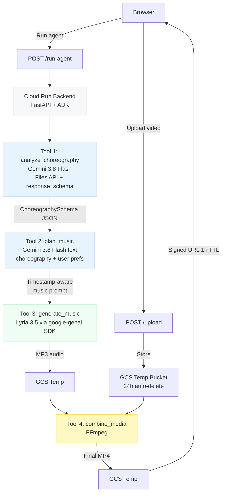

# Agentic Cinema

**Dance first. Music second.**

Upload your choreography. Get original music composed around your movement.

---

## The Problem

Short-form creators — on TikTok, Instagram Reels, YouTube Shorts — always start with a song and choreograph around it. The music drives the movement.

This forces creativity backwards. Your movement ideas are limited by what songs are available. You adapt your dance to the music, not the other way around.

## The Solution

Agentic Cinema reverses this workflow.

Upload a dance video with no music. Gemini analyzes the complete movement — timing, energy, accents, freezes, buildup, climax, final pose. That movement structure becomes the musical blueprint. Lyria composes an original soundtrack around your choreography.

The song follows the dance. Not the other way around.

---

## User Flow

```
1. Land on the page — no sign up
2. Click "Start Creating"
3. Upload your dance video (MP4, MOV, WebM — up to 100MB)
4. Select: Style, Mood, Energy, Movement Feel (optional)
5. Click "Generate Music"
6. See movement analysis: "6 moments detected · Intro → Hit → Spin → Freeze → Drop → Final Pose"
7. Wait ~45–90 seconds for generation
8. Preview the final video with its original soundtrack
9. Download and post
```

---

## Architecture



### Services

| Service | Role |
|---------|------|
| **Next.js on Cloud Run** | Frontend — landing page + creation interface |
| **FastAPI on Cloud Run** | Backend — ADK agent, Gemini, Lyria, FFmpeg |
| **Google Cloud Storage** | Temporary file storage (24h lifecycle) |
| **Gemini 3.8 Flash** | Video analysis + music plan reasoning |
| **Lyria 3.5** | AI music generation (via google-genai SDK) |
| **Google ADK** | Workflow agent orchestration |
| **FFmpeg** | Audio/video combine |

---

## AI Usage

### Gemini — Choreography Analysis (Tool 1)

Gemini receives the dance video via the **Files API** and analyzes the complete movement from start to finish. It returns a structured `ChoreographySchema` JSON using `response_schema` for strict output enforcement.

The schema captures:
- Timestamped movement segments with intensity (1–10)
- Key moments: accents, spins, freezes, jumps, climax, final pose
- Overall energy arc, movement tempo BPM, movement patterns
- Analysis confidence + notes (including fast-movement limitations)

**Known limitation**: Gemini samples video at approximately 1 FPS. Sub-second fast movements may be under-captured. The prompt and schema explicitly instruct the model to note uncertainty rather than fabricate detail.

### Gemini — Music Plan Reasoning (Tool 2)

A second Gemini call (text-only) converts the `ChoreographySchema` + user preferences into a **timestamp-aware natural language music prompt** for Lyria.

The reasoning step maps movement events to musical language:
```
accent       → strong drum hit / musical accent
freeze       → brief pause or sustained note  
buildup      → rising energy and instrumentation
climax_start → drop / high-energy section
final_pose   → strong conclusive ending
```

Example output:
```
18-second Afrobeat instrumental. Euphoric mood. Groovy feel. ~110 BPM.
[0:00-0:03] Restrained intro, light percussion and bass.
Around 0:03 strong drum accent matching the movement hit.
[0:03-0:07] Rising energy with expanding rhythm.
Around 0:07 swirling melodic transition for the spin.
Around 0:10 brief beat reduction — a breath for the freeze.
[0:11-0:18] Full high-energy drop with complete arrangement.
Around 0:18 strong conclusive hit for the final pose.
```

### Lyria — Music Generation (Tool 3)

Lyria receives the music plan and generates the complete original audio track. Accessed via the `google-genai` Python SDK using the Gemini API key — no separate MusicFX endpoint required.

**Honest disclaimer**: Timestamp instructions are **musical directions**, not sample-accurate beat sync guarantees. The music is composed around the choreography's energy structure — it reflects the movement arc, not frame-perfect synchronization.

### ADK Workflow Agent

The `ChoreographyMusicAgent` is a single deterministic **Google ADK workflow agent** that orchestrates all four tools in sequence. This satisfies the Agentic Cinema hackathon requirement for a functional AI agent powered by Google Cloud Agent Builder.

**Generate Again optimization**:
- Preferences unchanged: skip Tools 1+2, regenerate only music (Tools 3+4)
- Preferences changed: skip Tool 1, replan music (Tools 2+3+4)
- New video uploaded: full pipeline

---

## IBM Bob Contribution

This project was built entirely using **IBM Bob** (AI development environment).

| Phase | Bob Mode | What Bob did |
|-------|----------|-------------|
| Architecture | Plan Mode | Designed the full system, verified API capabilities, wrote `PLAN.md` |
| Risk validation | Plan Mode | Identified Lyria uncertainty, Gemini 1 FPS limitation, ADK requirement |
| Backend | Agent Mode | All Python code: FastAPI, Gemini service, Lyria service, ADK agent, FFmpeg service, GCS service, schemas, prompts, tests |
| Frontend | Agent Mode | All TypeScript/Next.js code: landing page, create page, all components, API client |
| Deployment | Agent Mode | Dockerfiles, Cloud Build, deploy scripts, `GCP_SETUP_AND_DEPLOY.md` |
| Documentation | Agent Mode | This README, all inline docstrings |

Bob conversation history is preserved as evidence of development process.

---

## Setup

See **[GCP_SETUP_AND_DEPLOY.md](GCP_SETUP_AND_DEPLOY.md)** for complete step-by-step deployment instructions.

### Quick local start

```bash
# Backend
cd backend
python3 -m venv .venv && source .venv/bin/activate
pip install -r requirements.txt
cp ../.env.example .env          # fill in GEMINI_API_KEY and GCS_TEMP_BUCKET
uvicorn main:app --reload --port 8080

# Frontend (new terminal)
cd frontend
npm install
echo "NEXT_PUBLIC_BACKEND_URL=http://localhost:8080" > .env.local
npm run dev
```

Open http://localhost:3000

---

## Environment Variables

| Variable | Required | Description |
|----------|----------|-------------|
| `GOOGLE_CLOUD_PROJECT_ID` | Yes | GCP project ID |
| `GCS_TEMP_BUCKET` | Yes | GCS bucket name for temporary storage |
| `GEMINI_API_KEY` | Yes | Gemini API key (also used for Lyria) |
| `GEMINI_MODEL` | Yes | Gemini model ID (verify in AI Studio) |
| `LYRIA_MODEL` | Yes | Lyria model ID (verify in AI Studio) |
| `FRONTEND_URL` | Yes (prod) | Deployed frontend URL for CORS |
| `NEXT_PUBLIC_BACKEND_URL` | Yes | Backend URL for frontend API calls |

Full reference: [`.env.example`](.env.example)

---

## Demo

1. Open the application (landing page)
2. Click "Start Creating →"
3. Upload a 10–18 second dance video
4. Select: **Afrobeat** / **Euphoric** / **High** / **Groovy**
5. Click "Generate Music"
6. Watch: `Analyzing choreography...` → `Composing music...` → `Preparing your video...`
7. See movement analysis: detected moments, energy, tempo
8. Play the final video — same dance, new original soundtrack
9. Download

---

## Known Limitations

| Limitation | Detail |
|-----------|--------|
| ~1 FPS video sampling | Gemini samples at approximately 1 FPS. Sub-second fast movements may be under-captured. The UI shows a warning when confidence is low. |
| Musical direction, not beat sync | Lyria timestamp instructions direct the energy arc and structure — they do not guarantee exact beat-to-frame alignment. |
| Lyria quota | Check your account quota before demo day. Pre-generate demo audio as backup. |
| Synchronous pipeline | The `/run-agent` request blocks for 45–120 seconds. This is acceptable for the current demo scale. |
| GCS signed URL expiry | Download links expire after 1 hour. Users should download promptly. |

---

## Future Scope

- Real-time status streaming (Server-Sent Events)
- Multiple music variations from same choreography
- Section-level style control (different feel per segment)
- BPM lock to detected movement tempo
- Waveform display synced to key moments
- Mobile-optimized upload

---

## Project Structure

```
agentic-cinema/
├── PLAN.md                     # Architecture plan (IBM Bob Plan Mode)
├── AGENTS.md                   # IBM Bob project context
├── GCP_SETUP_AND_DEPLOY.md     # Step-by-step deployment guide
├── README.md                   # This file
├── .env.example                # Environment variable template
├── frontend/                   # Next.js application
│   ├── app/                    # App Router pages
│   ├── components/             # UI components
│   ├── lib/                    # API client + types
│   └── Dockerfile
└── backend/                    # FastAPI application
    ├── main.py                 # FastAPI entry point
    ├── agent/                  # ADK workflow agent
    ├── services/               # Gemini, Lyria, GCS, FFmpeg
    ├── schemas/                # Pydantic models
    ├── prompts/                # Gemini prompt templates
    ├── routes/                 # API routes
    ├── scripts/                # Proof/validation scripts
    ├── tests/                  # Unit + integration tests
    └── Dockerfile
```

---

*Built for the Agentic Cinema Hackathon · Powered by Gemini, Lyria, Google ADK · Developed with IBM Bob*
