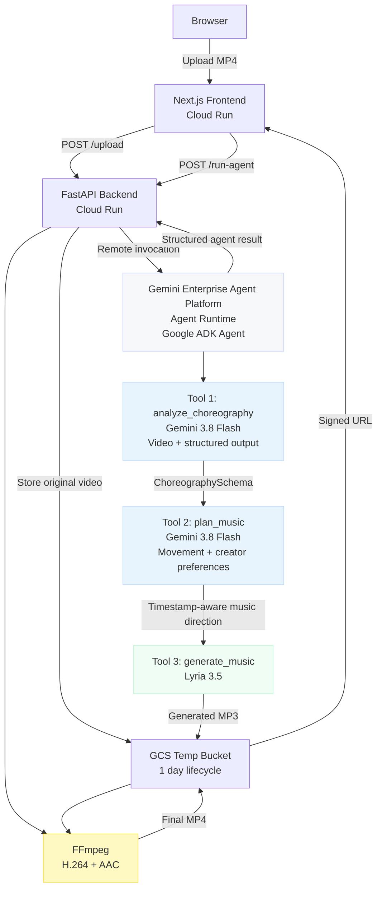

# MoveScore

**Dance first. Music second.**

Upload your choreography. Get original music composed around your movement.

**Live app:** https://movescore-frontend-tjzml33mta-uc.a.run.app

**Backend health:** https://movescore-backend-tjzml33mta-uc.a.run.app/health

---

## The Problem

Short-form creators usually start with music and build choreography around it. That works when the song comes first, but it becomes limiting when the movement comes first.

A rehearsal, freestyle, original routine, or brand movement may already have its own pacing and energy. Existing music generators start from text. They do not understand the choreography before composing.

## The Idea

MoveScore reverses the workflow.

Instead of:

```
Music -> Choreography
```

MoveScore does:

```
Choreography -> Movement understanding -> Musical direction -> Original music
```

A creator uploads a dance video. Gemini analyzes the choreography, including key movement moments, movement tempo, intensity, and the overall energy arc. A second reasoning step translates that analysis into timestamp-aware musical direction. Lyria 3.5 then composes original music around the movement structure.

The result is not frame-perfect beat synchronization. The timestamps are musical directions that help shape the composition around the choreography.

**MoveScore makes choreography the prompt.**

---

## User Flow

```
1. Open MoveScore
2. Upload an MP4 choreography video, up to 100 MB and 60 seconds
3. Choose:
   - Instrumental or Song / Vocals
   - Style
   - Mood
   - Energy
   - Movement Feel
   - Optional custom direction
4. Click "Generate Music"
5. Gemini analyzes the choreography
6. Gemini turns the movement analysis into timestamp-aware music direction
7. Lyria 3.5 generates original music
8. MoveScore combines the generated audio with the original video
9. Preview the final result
10. Download the MP4
```

---

## Production Architecture



The production backend invokes the deployed Agent Runtime resource directly. There is no production local fallback in the successful end-to-end path.

### Production Runtime

- **GCP project:** `gleamail`
- **Region:** `us-central1`
- **Agent Runtime:** `projects/1093246532955/locations/us-central1/reasoningEngines/2313598414480211968`
- **Backend Cloud Run revision:** `movescore-backend-00004-7ht`
- **Frontend Cloud Run revision:** `movescore-frontend-00001-kwg`
- **Runtime service account:** `movescore-backend-sa@gleamail.iam.gserviceaccount.com`

---

## Google Cloud Products Used

| Product | How MoveScore uses it |
|---|---|
| **Gemini Enterprise Agent Platform / Agent Runtime** | Hosts the production Google ADK agent that orchestrates the AI workflow |
| **Google ADK** | Defines the MoveScore agent and its choreography analysis, music planning, and music generation tools |
| **Gemini 3.8 Flash** | Multimodal choreography analysis and the movement-to-music planning step |
| **Lyria 3.5** | Generates the original soundtrack from the choreography-derived music direction |
| **Cloud Run** | Hosts the Next.js frontend and FastAPI backend |
| **Cloud Storage** | Stores uploaded video, generated audio, and final MP4 temporarily with a one-day lifecycle |
| **Secret Manager** | Stores the restricted Gemini API key used by the deployed runtime |
| **Artifact Registry** | Stores the production container images |
| **Cloud Build** | Builds deployment artifacts for Cloud Run |
| **IAM / service accounts** | Provides least-privilege access between runtime, storage, secrets, and Cloud Run |
| **Cloud Logging** | Used during production deployment and end-to-end troubleshooting |
| **Cloud Resource Manager** | Enabled for the deployed Agent Runtime session service |
| **Agent Platform Studio Speech / Gemini 3.1 Flash TTS (Preview)** | Used to generate narration for the hackathon demo video with the Umbriel male voice |

---

## How the AI Pipeline Works

### 1. Gemini Choreography Analysis

Gemini receives the choreography video and returns a strict structured `ChoreographySchema`.

The analysis captures:

- Timestamped movement segments
- Intensity from 1 to 10
- Key moments such as accents, spins, freezes, jumps, climax, and final pose
- Overall energy
- Estimated movement tempo BPM
- Movement patterns
- Analysis confidence
- Notes when movement is too fast or unclear to describe confidently

The prompt explicitly tells Gemini not to invent movement it cannot see.

### 2. Movement to Music Planning

A second Gemini 3.8 Flash call acts like a music director.

It receives the structured choreography plus the creator's choices:

- Style
- Mood
- Energy
- Movement feel
- Instrumental or Song / Vocals
- Optional custom instruction

The planner translates movement into musical language. Examples from the production prompt:

```
accent / hit  -> strong drum hit or musical accent
freeze        -> brief silence, breath, or sustained note
buildup       -> rising energy and expanding instrumentation
climax_start  -> drop or high-energy section
spin          -> swirling melodic or rhythmic transition
final_pose    -> strong, conclusive ending
```

The output is a concise natural-language music direction with approximate timestamps, total duration, overall energy arc, style, mood, instrumentation, and BPM when available.

### 3. Lyria 3.5 Music Generation

Lyria receives the choreography-derived music direction and generates the soundtrack.

MoveScore supports:

- Instrumental
- Song / Vocals

The music plan includes timestamp-aware directions, but these are intentionally treated as approximate musical guidance rather than sample-accurate synchronization.

### 4. Final Media Processing

The generated MP3 is stored in GCS and returned to the Cloud Run backend.

FFmpeg then combines the generated audio with the creator's original choreography video and produces a browser-compatible MP4:

- H.264
- `yuv420p`
- AAC
- Fast start enabled

The final result is stored temporarily and returned through a signed URL.

---

## Real Production Validation

The deployed application was tested end to end with a real 10-second MP4.

Verified production path:

```
Upload
-> GCS
-> Gemini Enterprise Agent Runtime
-> Gemini 3.8 Flash choreography analysis
-> Gemini 3.8 Flash music planning
-> Lyria 3.5
-> generated audio in GCS
-> Cloud Run FFmpeg
-> final MP4
-> browser playback
-> download
```

The production proof completed successfully.

- Gemini choreography analysis: success
- Music planning: success
- Lyria MP3 generation: success
- Final MP4 duration: 10.000 seconds
- Video: H.264, yuv420p, 1280x720
- Audio: AAC, 44.1 kHz stereo
- Full FFmpeg decode: passed
- Chrome UI flow: passed
- Final production API run: about 103 seconds

---

## IBM Bob and Google Antigravity

IBM Bob was the main development environment during the first and largest build phase.

I started in **Bob Plan Mode**, where I worked through the product architecture, the choreography-first workflow, API choices, limitations, and the initial Google Cloud deployment plan. I then used **Bob Agent Mode** for the initial implementation across the backend, frontend, prompts, schemas, tests, Docker setup, and deployment scripts.

As the project got close to production, my Bobcoins were almost exhausted. I handed the remaining production-hardening work to **Google Antigravity**. I used it to audit the existing implementation against the current Google SDKs and documentation, fix production blockers, harden Agent Runtime packaging and authentication, troubleshoot runtime and Cloud Run issues, and validate the final end-to-end path.

The final production architecture keeps the original choreography-first design and IBM Bob foundation, while the later hardening made the deployed version reliable enough for a real browser demo.

---

## Demo Input Disclosure

The choreography used in the hackathon demo is synthetic test footage generated with Google Gemini.

Prompt:

> "Create a 10-second dance choreography video. Don't give it a good song; I'm interested in the dance only. Make it nice, smooth, and energetic, like someone is rehearsing."

I intentionally used a simple rehearsal-style choreography clip so the input movement is clear and the demo can focus on what MoveScore adds: the new music.

The demo narration was generated in **Google Cloud Agent Platform Studio** using **Gemini 3.1 Flash TTS (Preview)** with the **Umbriel (Male)** voice.

---

## Known Limitations

| Limitation | Detail |
|---|---|
| Fast movement analysis | Very fast sub-second movement can be harder for video understanding to capture precisely |
| Musical direction, not frame-perfect beat sync | Timestamp instructions shape musical structure and energy, but they are not sample-accurate synchronization guarantees |
| Lyria duration is approximate | Generated audio can be longer than the choreography, so FFmpeg uses the choreography video as the final duration boundary |
| Synchronous request | A full production run currently takes around 1 to 2 minutes |
| MP4-only MVP | The production upload path intentionally accepts MP4 only for reliability |
| Temporary result URLs | Signed result URLs expire, and GCS objects are automatically removed by the one-day lifecycle |

---

## Development and Deployment Notes

### Local backend

```bash
cd backend
python3 -m venv .venv
source .venv/bin/activate
pip install -r requirements.txt
cp ../.env.example .env
uvicorn main:app --reload --port 8080
```

### Local frontend

```bash
cd frontend
npm install
echo "NEXT_PUBLIC_BACKEND_URL=http://localhost:8080" > .env.local
npm run dev
```

For production details, see [GCP_SETUP_AND_DEPLOY.md](GCP_SETUP_AND_DEPLOY.md).

---

## Project Structure

```
MoveScore/
├── PLAN.md
├── AGENTS.md
├── GCP_SETUP_AND_DEPLOY.md
├── README.md
├── devpost_submission.md
├── .env.example
├── frontend/
│   ├── app/
│   ├── components/
│   ├── lib/
│   └── Dockerfile
├── backend/
│   ├── main.py
│   ├── agent/
│   ├── services/
│   ├── schemas/
│   ├── prompts/
│   ├── routes/
│   ├── scripts/
│   ├── tests/
│   └── Dockerfile
└── scripts/
    ├── deploy-agent-runtime.py
    ├── deploy-backend.sh
    ├── deploy-frontend.sh
    └── gcs-lifecycle.json
```

---

## What's Next

If I continue MoveScore after the hackathon, the first things I would explore are:

- More precise temporal understanding for fast choreography
- Multiple music variations from one choreography
- Section-level creative direction
- Faster asynchronous generation with progress streaming
- Better mobile creator workflow
- A/B comparison between different music directions for the same movement

---

*Built for the Agentic Cinema Hackathon. Powered by Gemini Enterprise Agent Platform, Google ADK, Gemini 3.8 Flash, Lyria 3.5, Cloud Run, and Google Cloud.*
